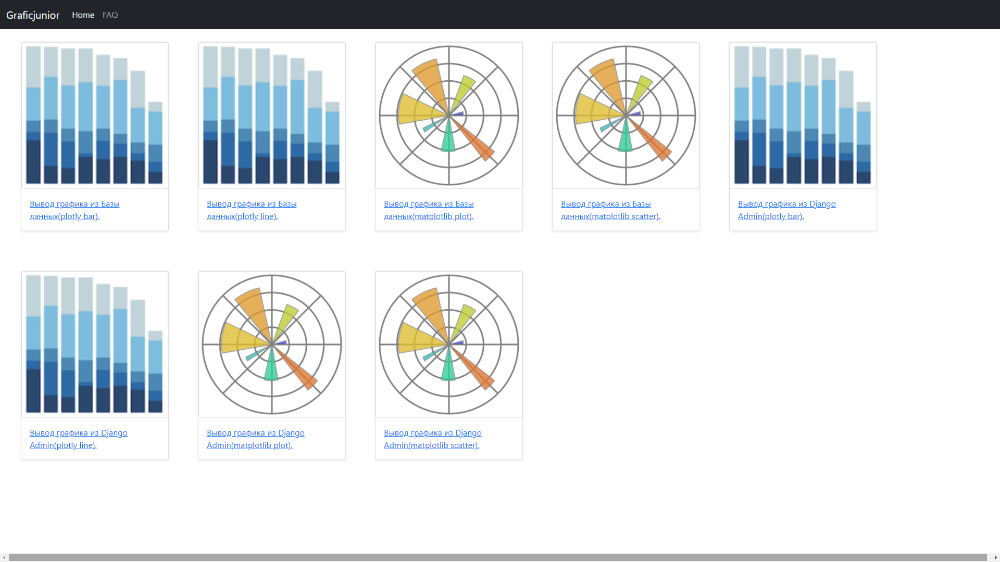
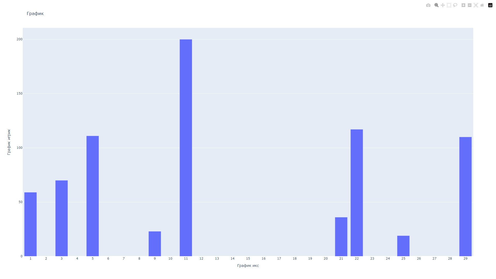
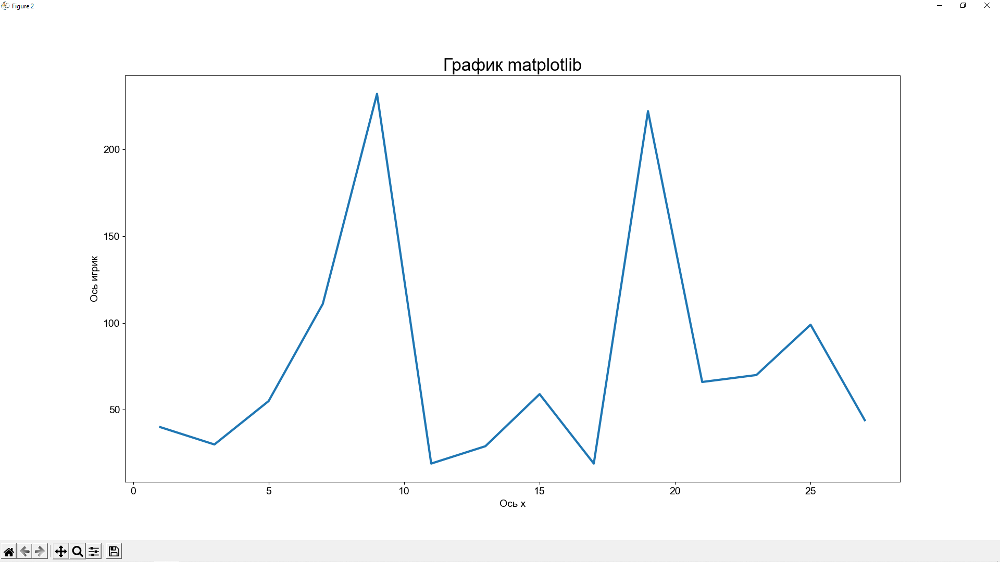

<h1>Data mining project on Django</h1>
<h3>Cуть проекта использование библиотек питона:Plotly и MatPlotlib и построение графиков
на основе данных,взятых из локальной базы данных и из базы данных Django(из админки джанго) 
Use Plotly and MatPlotlib to make diagrams,info taken from local database and Django database 
В проекте представлены графики:Гистограмма,диограмма-линия,точечный график. 
In this project you can see: Histogram, line chart, scatter plot.</h3>

<h3>Вид заглавной страницы</h3> 
Main page

<h3>Вид Plotly графика</h3> 
Plotly diagram

<h3>Вид MatPlotlib графика</h3> 
MathPlotlib diagram

<h3>Проект небольшой но его можно легко дополнить разными видами графиков.Проект был создан для портфолио Python Junior
разработчика т.е меня :/</h3>
